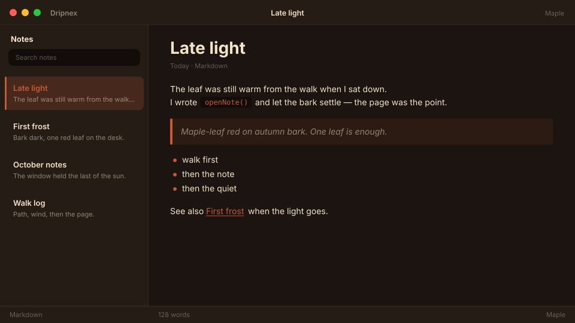

# Maple

Autumn bark. Maple-leaf red, late light.



```
dripnex/theme-maple
```

## Palette

The chips live in [palette.html](palette.html) — open it in a browser. GitHub won’t paint HTML swatches here, so the hex list is below.

| Name | Token | Color | What it’s for |
| --- | --- | --- | --- |
| Base | `--bg-base` | `#1b1410` | Window background |
| Surface | `--bg-surface` | `#261c16` | Sidebar and chrome |
| Elevated | `--bg-elevated` | `#33251c` | Raised panels |
| Text | `--text-primary` | `#f3e4c8` | Headings and body |
| Muted | `--text-muted` | `#f3e4c8 · rgba(243, 228, 200, 0.52)` | Secondary copy |
| Accent | `--accent` | `#c85a32` | Selection and links |
| Active | `--status-active` | `#c85a32` | Active status |
| Dropped | `--status-dropped` | `#c46b6b` | Dropped status |

Pick it for late autumn: bark dark, a red leaf on the desk, not coffee and not copper frost.
